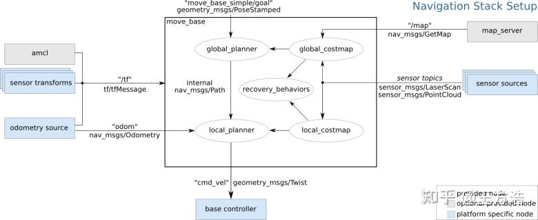

# rm2023_auto_sentry_ws
 RM2023华南农业大学Taurus机器人战队哨兵定位导航算法与仿真开源

RM2023哨兵技术报告开源https://bbs.robomaster.com/forum.php?mod=viewthread&tid=22779

RM2022自动步兵开源链接https://github.com/SCAU-RM-NAV/rm2022_auto_infantry_ws

## 简介
本项目提供一种低成本二维激光雷达的哨兵导航定位算法实现，并在RMUC仿真赛场上实现，将详细讲述技术点、使用方法和原理，希望能对其他队伍有所帮助。受限于时间原因，部分内容将以后进行补充。

我们哨兵机器人使用了二维激光雷达的方案，整体算法架构与navigation框架类似，在此基础上改进了定位和轨迹跟踪算法，使之能够实现快速的定位修正和小陀螺过程中的导航，同时实现了定位丢失后的重定位。

项目环境
* Ubuntu20.04
* ros Noetic

硬件环境
* intel i7-1165G7工控机

## 代码框架
```
└── src
    ├── auto_nav                            导航功能包
    │   ├── CMakeLists.txt
    │   ├── config
    │   │   ├── point_pid_params            导航参数文件
    │   │   │   ├── costmap_common_params.yaml
    │   │   │   ├── global_costmap_params.yaml
    │   │   │   ├── local_costmap_params.yaml
    │   │   │   └── teb_local_planner_params.yaml
    │   │   └── rviz
    │   │       └── auto_navi_demo.rviz
    │   ├── example
    │   │   ├── pid.c
    │   │   └── pid.h
    │   ├── include                 pid轨迹跟踪代码头文件
    │   │   ├── cubic_spline
    │   │   │   ├── cpprobotics_types.h
    │   │   │   ├── cubic_spline.h
    │   │   │   └── cubic_spline_ros.h
    │   │   ├── pid.h
    │   │   ├── pid_position_follow.h
    │   │   └── utility.h
    │   ├── launch                  定位导航launch文件
    │   │   ├── amcl_simple_meca_car.launch
    │   │   ├── navi_simple_meca_car_pid.launch
    │   │   └── pid_follow_planner.launch
    │   ├── map
    │   │   ├── rmuc_map_draw.pgm
    │   │   └── rmuc_map_draw.yaml
    │   ├── package.xml
    │   └── src
    │       ├── pid.cpp
    │       └── pid_position_follow.cpp   pid轨迹跟踪代码
    ├── roborts_msgs                自定义数据类型功能包
    │   ├── CMakeLists.txt
    │   ├── msg
    │   │   ├── GameStatus.msg
    │   │   ├── LocationInfo.msg    定位信息自定义数据类型
    │   │   └── RobotStatus.msg
    │   ├── package.xml
    │   └── srv
    │       ├── PidPlannerStatus.srv
    │       └── Relocate.srv        重定位自定义服务数据类型
    ├── scan_to_map             定位算法功能包
    │   ├── CMakeLists.txt
    │   ├── include             定位代码头文件
    │   │   └── scan_to_map_location.h
    │   ├── launch              定位代码launch文件
    │   │   ├── robot_localization_icp.launch 
    │   │   └── scan_to_map_location.launch
    │   ├── package.xml
    │   ├── param               定位参数文件
    │   │   ├── icp_params.yaml         icp匹配参数
    │   │   └── robot_localization.yaml     robot_localization功能包的EKF实现参数
    │   └── src
    │       └── scan_to_map_location.cpp        ICP匹配定位代码
    └── simple_meca_car         仿真模型功能包
        ├── CMakeLists.txt
        ├── launch              仿真launch文件
        │   └── race.launch
        ├── meshes
        │   ├── base_link.stl
        │   ├── bot.dae
        │   └── hokuyo.dae
        ├── package.xml
        ├── urdf                urdf模型文件
        │   ├── rmus_map_2.urdf
        │   └── waking_robot.xacro
        └── world               地图模型文件
            ├── RMUC_world
            │   ├── meshes
            │   │   └── place.dae
            │   ├── model.config
            │   ├── model.sdf
            │   └── rmuc.world
            ├── auto_world
            │   ├── auto_world.world
            │   ├── meshes
            │   │   └── auto_world.dae
            │   ├── model.config
            │   └── model.sdf
            └── empty_world.world

```
## 使用方法
安装依赖包
```
sudo apt-get install ros-noetic-navigation
sudo apt-get install ros-noetic-robot-localization
```
(后续编译与运行过程中如果有依赖功能包未安装，按类似的方法安装)

克隆存储库并catkin_make：
```
cd ~/catkin_ws/src
git clone https://github.com/SCAU-RM-NAV/rm2023_auto_sentry_ws.git
cd ../
catkin_make
source ~/catkin_ws/devel/setup.bash
```

启动仿真
```
roslaunch simple_meca_car race.launch 
```
启动定位与导航
```
roslaunch auto_nav navi_simple_meca_car_pid.launch 
```

## 算法原理

ROS中的navigation提供了一套框架，可以让我们灵活的选择global_planner 、local_planner 来提供路径规划功能，navigation原本框架就能实现基本的导航与定位功能
以下为ROS导航模块官方的框图：



本项目在上述框架基础上改进了定位和轨迹跟踪算法

### 定位算法原理
在原本AMCL算法中，由于AMCL是使用里程计数据进行粒子集的更新，当机器人打滑或地面子弹较多时，里程计数据更新不准确就会导致粒子集更新不准确，粒子集更新不准确进一步导致定位的不准确，同时粒子滤波收敛慢也使得机器人在小陀螺或者高速运动时定位效果不佳，所以我们对其进行改进，使用点云配准的方法快速进行定位修正。

在定位模块中，我们使用里程计数据维护odom到base_link的坐标变换（实际项目中也可以使用3维激光里程计，可以得到更好的效果），同时使用激光雷达点云数据和地图点云数据进行ICP点云配准，得到全局坐标系下机器人定位，使用开源的robot_localization实现EKF，融合ICP得到的全局坐标和里程计和imu的数据，维护map到odom这段tf的变换。


在重定位算法上，我们使用旋转点云+ICP匹配的方法实现重定位，用暴力搜索的方法得到最优解。该方法除了在机器人卡在坡上等较极端条件下都能达到较好的重定位效果。

## 轨迹跟踪算法原理

在轨迹跟踪模块中，读取全局路径规划模块中的全局路径，根据前视距离参数取一段路径，使用贝塞尔曲线进行轨迹平滑，然后使用位置pid进行轨迹跟踪，同时做了角速度映射，实现了小陀螺过程中导航。

```详细算法原理可参考开源技术报告```